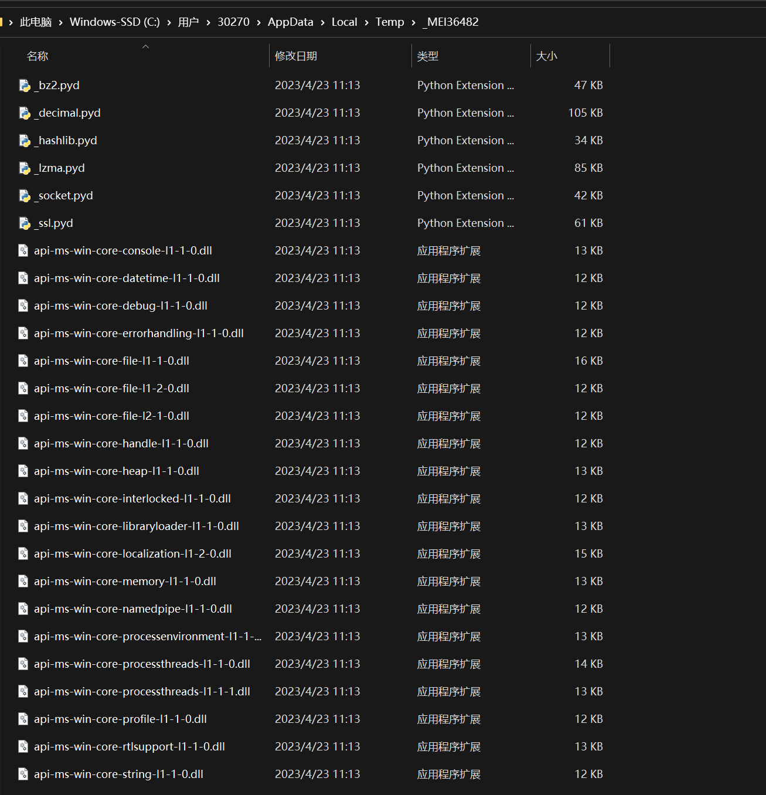
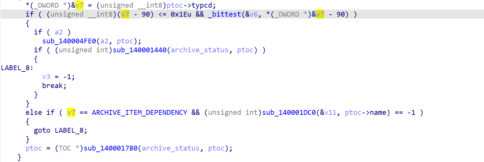
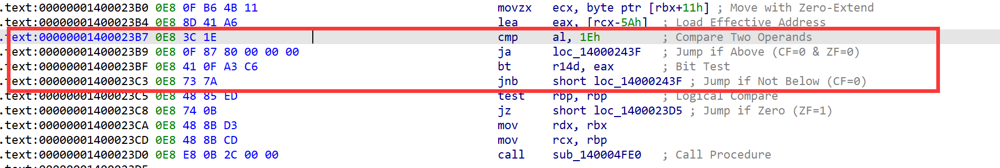
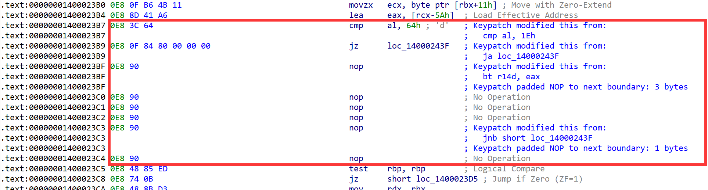
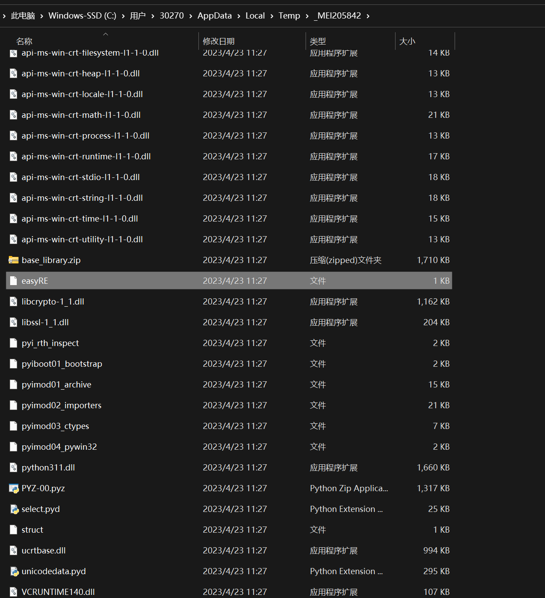
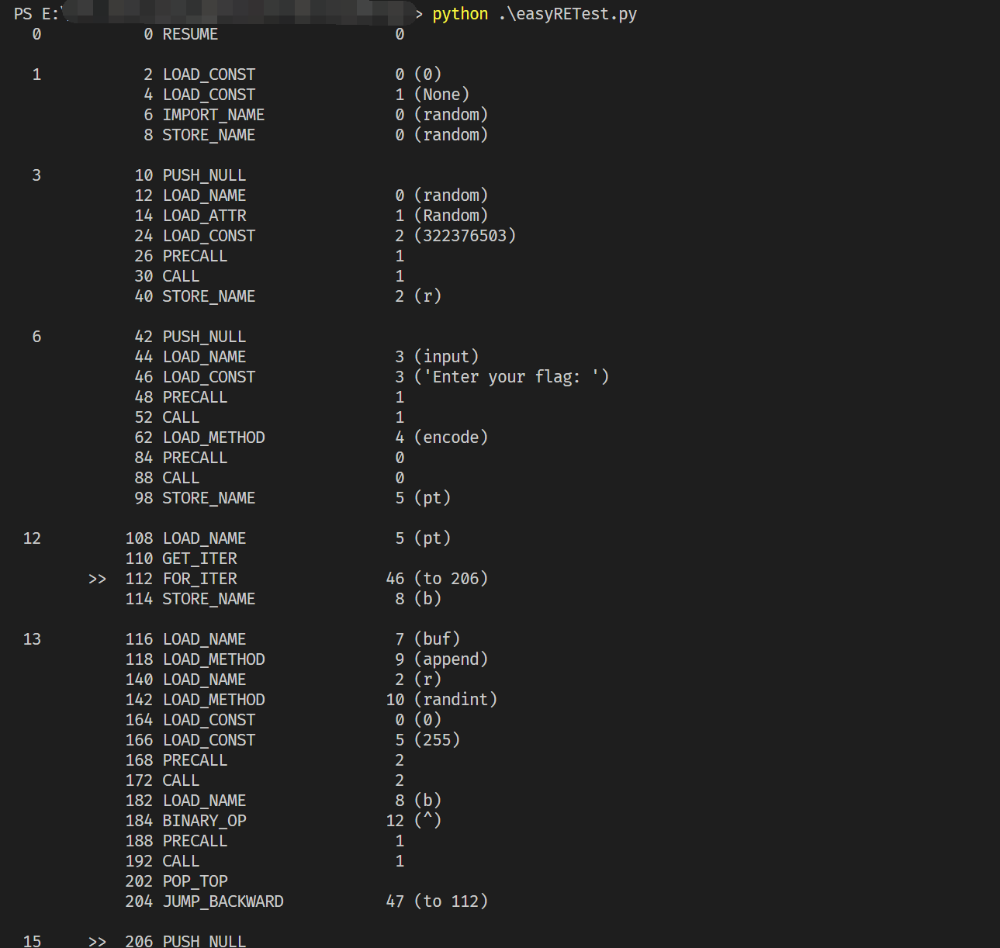

# 00-pyinstaller

## 0x00 - Introduction
pyinstaller打包的程序可以通过pyinstxtractor进行解压，但是对于带有key参数的结果无能为力。网上也有一些其它的办法通过魔改其源码等等来对其进行提取的，但在这里我们提供一种更符合RE思维的方法进行解决。

## 0x01 - Hint
当我们运行pyinstaller打包的程序时，它会在形如`C:\Users\用户名\AppData\Local\Temp`的目录下建立一个名为`_MEIXXXX`的文件夹，所有的运行库等数据都会存放在这里，如图：


但是其中并没有我们需要的pyc文件，假如程序在释放的时候就能够将pyc文件一起放出，那我们的目的就直接达到了。考虑到pyinstaller是开源的，我们可以直接查看其源码，尝试修改。

## 0x02 - Source Code
根据pyinstaller的[代码仓库](https://github.com/pyinstaller/pyinstaller/tree/develop)，我们容易找到解压相关的[代码](https://github.com/pyinstaller/pyinstaller/blob/develop/bootloader/src/pyi_launch.c#L285-L357)。其中需要重点关注的是这样的一个判断：
```c
        if (ptoc->typcd == ARCHIVE_ITEM_BINARY || ptoc->typcd == ARCHIVE_ITEM_DATA ||
            ptoc->typcd == ARCHIVE_ITEM_ZIPFILE) {
```

与我们上面的图对照，显然正是因为这个限制我们才未能将所有代码解压。结合宏定义：
```c
#define ARCHIVE_ITEM_BINARY           'b'  /* binary */
#define ARCHIVE_ITEM_DEPENDENCY       'd'  /* runtime option */
#define ARCHIVE_ITEM_PYZ              'z'  /* zlib (pyz) - frozen Python code */
#define ARCHIVE_ITEM_ZIPFILE          'Z'  /* zlib (pyz) - frozen Python code */
#define ARCHIVE_ITEM_PYPACKAGE        'M'  /* Python package (__init__.py) */
#define ARCHIVE_ITEM_PYMODULE         'm'  /* Python module */
#define ARCHIVE_ITEM_PYSOURCE         's'  /* Python script (v3) */
#define ARCHIVE_ITEM_DATA             'x'  /* data */
#define ARCHIVE_ITEM_RUNTIME_OPTION   'o'  /* runtime option */
#define ARCHIVE_ITEM_SPLASH           'l'  /* splash resources */
```
因此我们要做的很简单了，就是将`ARCHIVE_ITEM_PYMODULE`也解压出来。但是考虑到下面的：
```c
else {
            /* 'Multipackage' feature - dependency is stored in different executables. */
            if (ptoc->typcd == ARCHIVE_ITEM_DEPENDENCY) {
```
同时也是为了方便起见，我们在patch的时候将这个判断条件改为`ptoc->typcd != ARCHIVE_ITEM_DEPENDENCY`即可。

## 0x03 - Patch
下面以一个pyinstaller程序为例，首先参照源码结构定位到`pyi_launch_extract_binaries`函数所在位置：

其中`if`语句部分反汇编代码如下：

我们将其改为如下代码即可：
```
cmp	al, 0x64 	; ARCHIVE_ITEM_DEPENDENCY
je	0x14000243F	; jmp if typcd == ARCHIVE_ITEM_DEPENDENCY
```

直接在hex editor中找到对应片段修改即可，再次运行patch后的代码：


可以发现pyc文件已经被提取出来。事实上，该文件并不是pyc文件，而是pyc文件中蕴含的字节码对象，因此需要手动加上pyc的头才可以使用反编译工具。但考虑到反编译工具对于python3.7之后的版本支持的并不是太好，我们可以使用对应的python版本直接读取其字节码进行查看：
```python
import dis, marshal
dis.dis(marshal.loads(open('easyRE', 'rb').read()))
```

运行即可得到结果：

对着字节码即可还原出源代码，剩下部分不在本文讨论范围之内。